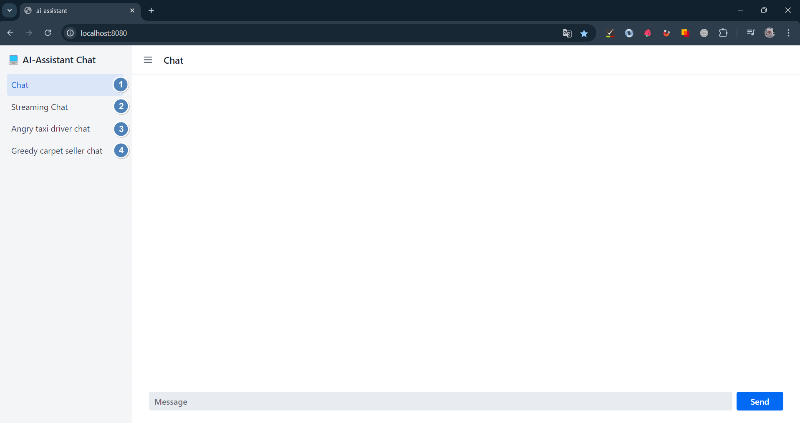
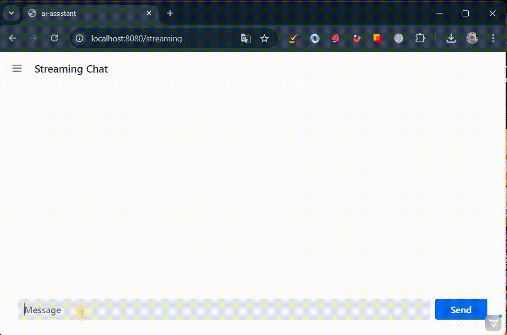

# Demo OpenAI Chat application

## Technologies used

<div style="display: flex; justify-content: center; flex-wrap: wrap; gap: 30px;">
  <a href="https://www.java.com/" style="flex: 1 1 10%; text-align: center;">
    
  </a>
  <a href="https://spring.io/" style="flex: 1 1 10%; text-align: center;">
    
  </a>
  <a href="https://maven.apache.org/" style="flex: 1 1 10%; text-align: center;">
    
  </a>
  <a href="https://react.dev" style="flex: 1 1 10%; text-align: center;">
    
  </a>
   <a href="https://docs.langchain4j.dev/" style="flex: 1 1 10%; text-align: center;">
    
  </a> 
  <a href="https://vaadin.com/" style="flex: 1 1 10%; text-align: center;">
    
  </a>
</div>

## Requirements

- Java 17+
- OpenAI API key in `OPENAI_API_KEY` environment variable.

## Running the application

1. Run the app by running `Application.java` in your IDE or with the default Maven command `mvn`.
2. Run docker container using this command line:

```bash
docker run --rm --name ai-chat -p 8080:8080 -e openai.api.key=<Real OpenAI API key must be here> ilananull/ai-assistant:0.1
```

### Working space

<a>
    
</a> 

1. <ins>**Chat**</ins>  
   When we use this view we need to spend some time waiting for the response to be generated, after which the response
   will
   be output immediately and completely.


2. <ins>**Streaming Chat**</ins>
   LLMs generate text one token at a time, so many LLM providers, including OpenAI, offer a way to stream the response
   token-by-token instead of waiting for the entire text to be generated. This significantly improves the user
   experience,
   as the user does not need to wait an unknown amount of time and can start reading the response almost immediately.

<a>
  
</a>

3. <ins>**Angry taxi driver chat**</ins>  
   A small AI LLM game in which you have to convince an evil taxi driver to take you somewhere for free. Streaming chat
   model is used, System prompting is used to clarify answers
  


4. <ins>**Greedy carpet seller chat**</ins>  
   A small AI LLM game in which you have to persuade a greedy carpet seller to give you a carpet for free. The
   corresponding System prompt is used to clarify the answers. A streaming chat model is used to output the answer.

